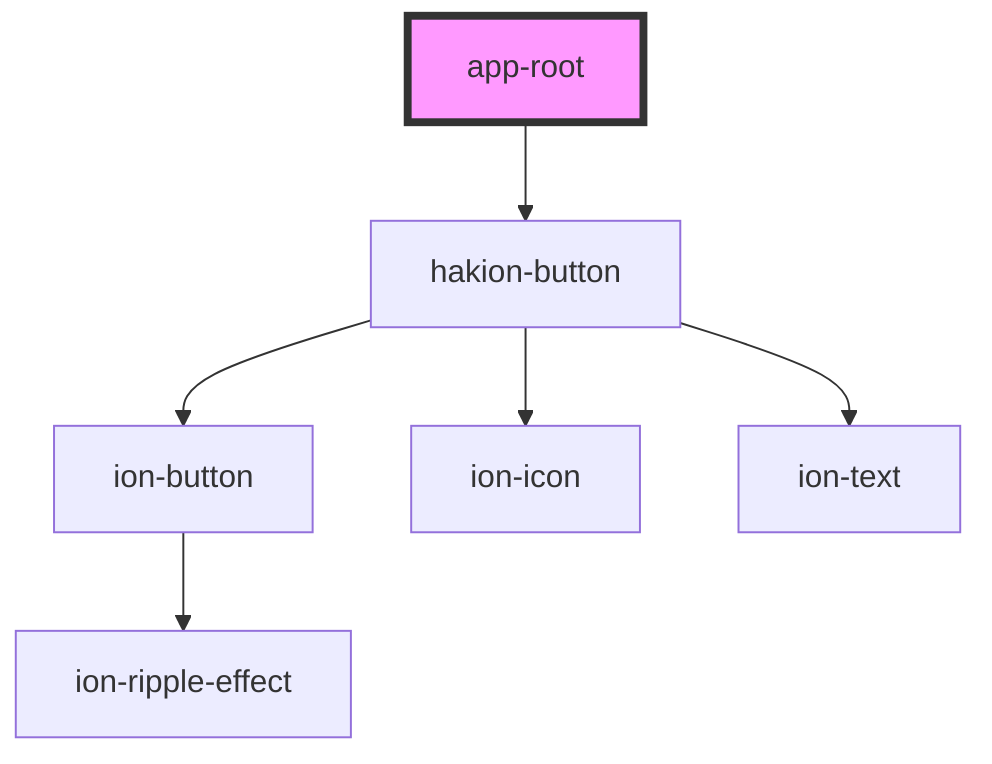

# hakion-ui-root

<!-- Auto Generated Below -->

## Properties

| Property     | Attribute     | Description | Type            | Default       |
| ------------ | ------------- | ----------- | --------------- | ------------- |
| `dark`       | `dark`        |             | `"off" \| "on"` | `'off'`       |
| `inputState` | `input-state` |             | `"OFF" \| "ON"` | `undefined`   |
| `legend`     | `legend`      |             | `string`        | `'Dark Mode'` |
| `light`      | `light`       |             | `"off" \| "on"` | `'on'`        |

## Dependencies

### Depends on

- [hakion-button](../hakion-button)

### Graph

----------------------------------------------

*Built with [StencilJS](https://stenciljs.com/)*
