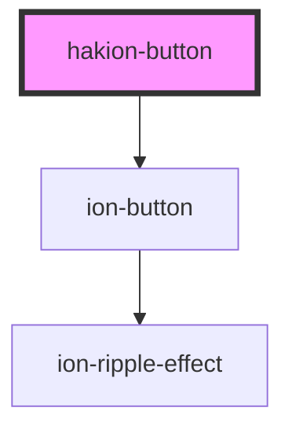

# hakion-button

<!-- Auto Generated Below -->

## Properties

| Property | Attribute | Description               | Type                           | Default           |
| -------- | --------- | ------------------------- | ------------------------------ | ----------------- |
| `kind`   | `kind`    |                           | `"block" \| "error" \| "full"` | `"block"`         |
| `text`   | `text`    | Documentation is required | `string`                       | `'hakion-button'` |

## Events

| Event         | Description | Type               |
| ------------- | ----------- | ------------------ |
| `acknowledge` |             | `CustomEvent<any>` |

## Dependencies

### Depends on

- ion-button

### Graph

----------------------------------------------

*Built with [StencilJS](https://stenciljs.com/)*
