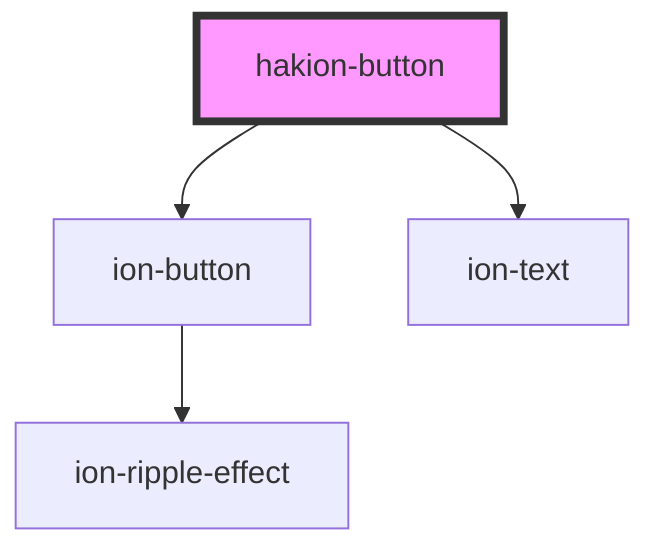

# hakion-button

<!-- Auto Generated Below -->

## Properties

| Property | Attribute | Description                                                                                                 | Type                                                                                                            | Default                            |
| -------- | --------- | ----------------------------------------------------------------------------------------------------------- | --------------------------------------------------------------------------------------------------------------- | ---------------------------------- |
| `color`  | `color`   | Documentation is required                                                                                   | `"danger" \| "dark" \| "light" \| "medium" \| "primary" \| "secondary" \| "success" \| "tertiary" \| "warning"` | `'primary'`                        |
| `expand` | `expand`  | Set to "block" for a full-width button or to "full" for a full-width button without left and right borders. | `"block" \| "full"`                                                                                             | `'block'`                          |
| `fill`   | `fill`    |                                                                                                             | `"clear" \| "outline" \| "solid"`                                                                               | `'solid'`                          |
| `text`   | `text`    | Documentation is required                                                                                   | `string`                                                                                                        | `'text:Prop() in <hakion-button>'` |

## Events

| Event         | Description                                                                                  | Type                            |
| ------------- | -------------------------------------------------------------------------------------------- | ------------------------------- |
| `acknowledge` | Define interface for argument type. You can access Props() in detail. eg: event.details.when | `CustomEvent<AcknowledgeEvent>` |

## Dependencies

### Depends on

- ion-button
- ion-text

### Graph

----------------------------------------------

*Built with [StencilJS](https://stenciljs.com/)*
