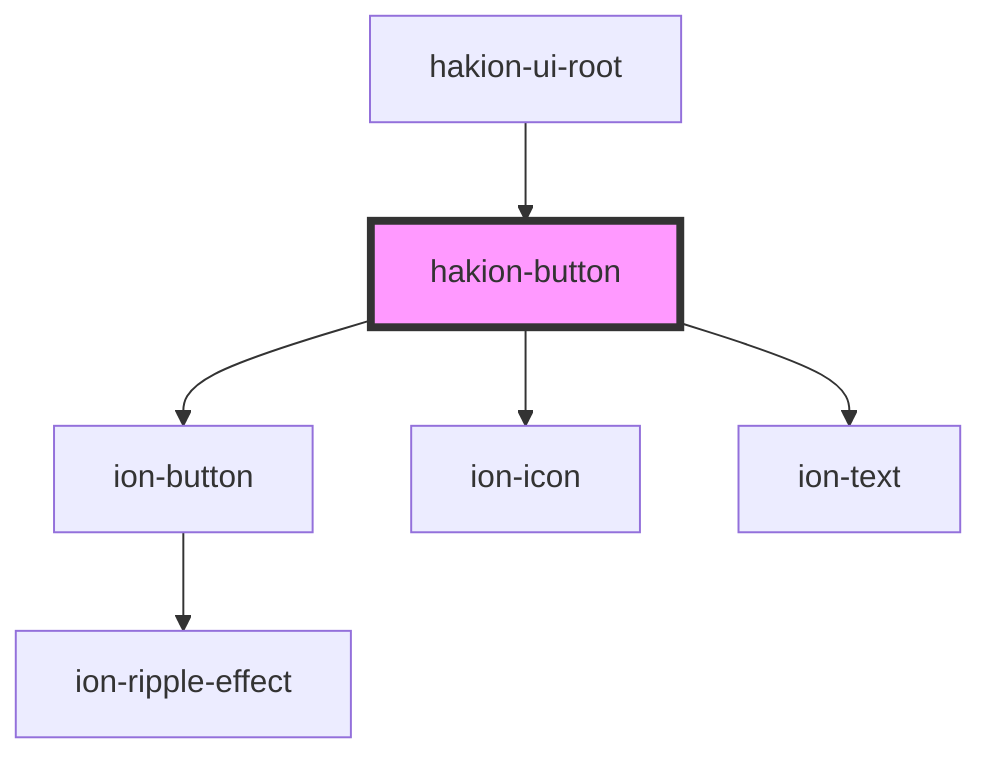

# hakion-button


<!-- Auto Generated Below -->


## Properties

| Property      | Attribute      | Description                                                                                                                                                                                                                                                                               | Type                                                                                                                         | Default          |
| ------------- | -------------- | ----------------------------------------------------------------------------------------------------------------------------------------------------------------------------------------------------------------------------------------------------------------------------------------- | ---------------------------------------------------------------------------------------------------------------------------- | ---------------- |
| `color`       | `color`        | The color to use from your application's color palette. Default options are: "primary", "secondary", "tertiary", "success", "warning", "danger", "light", "medium", and "dark".                                                                                                           | `"danger" \| "dark" \| "light" \| "medium" \| "primary" \| "secondary" \| "success" \| "tertiary" \| "warning" \| undefined` | `'primary'`      |
| `disabled`    | `disabled`     | If true, the user cannot interact with the button.                                                                                                                                                                                                                                        | `boolean`                                                                                                                    | `false`          |
| `download`    | `download`     | This attribute instructs browsers to download a URL instead of navigating to it, so the user will be prompted to save it as a local file. If the attribute has a value, it is used as the pre-filled file name in the Save prompt (the user can still change the file name if they want). | `string \| undefined`                                                                                                        | `undefined`      |
| `expand`      | `expand`       | This attribute lets you specify how wide the button should be. By default, buttons are inline blocks, but setting this attribute will change the button to a full-width block element.                                                                                                    | `"block" \| "full" \| "inline-block"`                                                                                        | `'inline-block'` |
| `fill`        | `fill`         | Set to "clear" for a transparent button, to "outline" for a transparent button with a border, or to "solid". The default style is "solid" except inside of                                                                                                                                | `"clear" \| "outline" \| "solid"`                                                                                            | `'solid'`        |
| `href`        | `href`         | If this property is set, an anchor tag will be rendered.                                                                                                                                                                                                                                  | `string \| undefined`                                                                                                        | `undefined`      |
| `iconName`    | `icon-name`    | If this property is set, an anchor tag will be rendered. If set to "icon-only," all other content will be ignored.                                                                                                                                                                        | `string \| undefined`                                                                                                        | `undefined`      |
| `iconSize`    | `icon-size`    | Use custom icon by specifying a path. If set, any value set on `ionIcon` will be ignored.                                                                                                                                                                                                 | `"large" \| "small" \| undefined`                                                                                            | `undefined`      |
| `iconSlot`    | `icon-slot`    | If this property is set, an anchor tag will be rendered. If set to "icon-only," all other content will be ignored.                                                                                                                                                                        | `"" \| "end" \| "icon-only" \| "start"`                                                                                      | `''`             |
| `iconSrc`     | `icon-src`     | Use custom icon by specifying a path. If set, any value set on `ionIcon` will be ignored.                                                                                                                                                                                                 | `string \| undefined`                                                                                                        | `undefined`      |
| `iconVariant` | `icon-variant` | If this property is set, an anchor tag will be rendered. If set to "icon-only," all other content will be ignored.                                                                                                                                                                        | `"" \| "filled" \| "outline" \| "sharp"`                                                                                     | ````             |
| `mode`        | `mode`         | The mode determines which platform styles to use.                                                                                                                                                                                                                                         | `"ios" \| "md"`                                                                                                              | `'ios'`          |
| `rel`         | `rel`          | Specifies the relationship of the target object to the link object. The value is a space-separated list of link types.                                                                                                                                                                    | `string \| undefined`                                                                                                        | `undefined`      |
| `shape`       | `shape`        | The button shape.                                                                                                                                                                                                                                                                         | `string \| undefined`                                                                                                        | `undefined`      |
| `strong`      | `strong`       | If true, activates a button with a heavier font weight.                                                                                                                                                                                                                                   | `boolean`                                                                                                                    | `false`          |
| `text`        | `text`         |                                                                                                                                                                                                                                                                                           | `string \| undefined`                                                                                                        | `undefined`      |
| `textColor`   | `text-color`   | The color to use for the text if the attribute `text` is set. Will not affect anything between <slot>                                                                                                                                                                                     | `"danger" \| "dark" \| "light" \| "medium" \| "primary" \| "secondary" \| "success" \| "tertiary" \| "warning" \| undefined` | `undefined`      |
| `type`        | `type`         | The type of the button.                                                                                                                                                                                                                                                                   | `string \| undefined`                                                                                                        | `undefined`      |


## Events

| Event         | Description | Type               |
| ------------- | ----------- | ------------------ |
| `acknowledge` |             | `CustomEvent<any>` |


## Shadow Parts

| Part            | Description |
| --------------- | ----------- |
| `"button"`      |             |
| `"button-icon"` |             |
| `"button-text"` |             |


## Dependencies

### Used by

 - [hakion-ui-root](../hakion-ui-root)

### Depends on

- ion-button
- ion-icon
- ion-text

### Graph


----------------------------------------------

*Built with [StencilJS](https://stenciljs.com/)*
