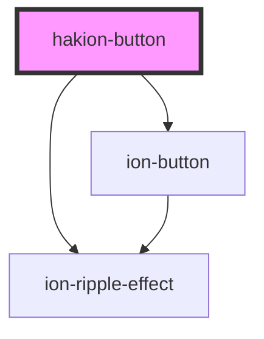

# hakion-button

<!-- Auto Generated Below -->

## Properties

| Property | Attribute | Description | Type     | Default           |
| -------- | --------- | ----------- | -------- | ----------------- |
| `label`  | `label`   |             | `string` | `"hakion-button"` |

## Dependencies

### Depends on

- ion-ripple-effect
- ion-button

### Graph

----------------------------------------------

*Built with [StencilJS](https://stenciljs.com/)*
