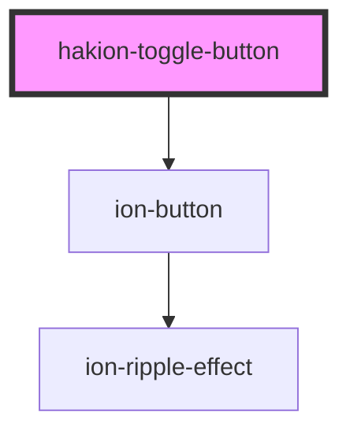

# hakion-toggle-button

<!-- Auto Generated Below -->

## Properties

| Property         | Attribute         | Description | Type      | Default |
| ---------------- | ----------------- | ----------- | --------- | ------- |
| `defaultPressed` | `default-pressed` |             | `boolean` | `false` |
| `pressedText`    | `pressed-text`    |             | `string`  | `'ON'`  |
| `unpressedText`  | `unpressed-text`  |             | `string`  | `'OFF'` |

## Dependencies

### Depends on

- ion-button

### Graph

----------------------------------------------

*Built with [StencilJS](https://stenciljs.com/)*
