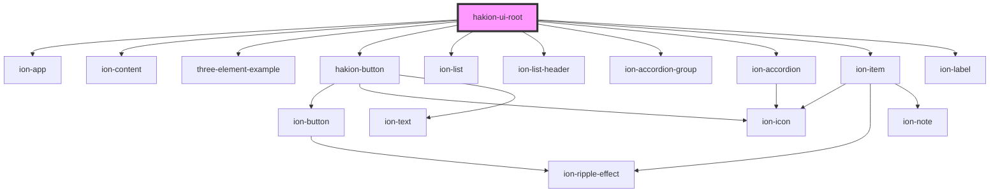

# hakion-ui-root

<!-- Auto Generated Below -->

## Dependencies

### Depends on

- ion-app
- ion-content
- [three-element-example](../three-element-example)
- [hakion-button](../hakion-button)
- ion-list
- ion-list-header
- ion-accordion-group
- ion-accordion
- ion-item
- ion-label

### Graph

----------------------------------------------

*Built with [StencilJS](https://stenciljs.com/)*
